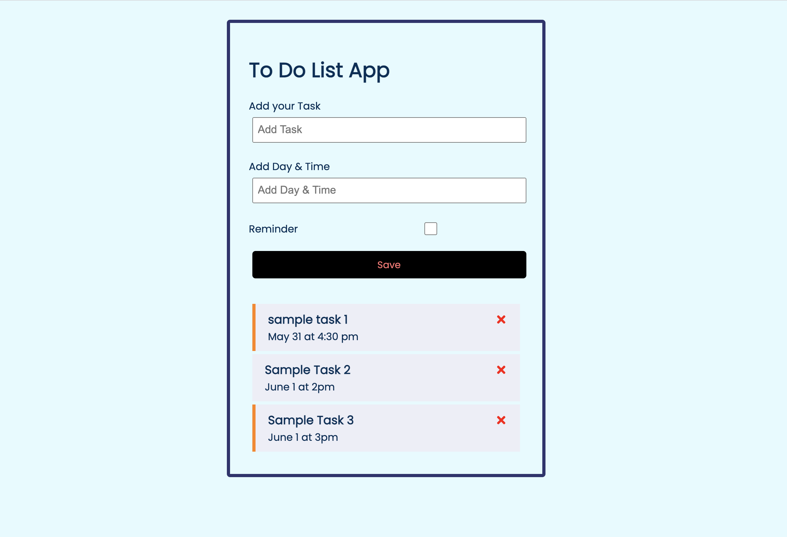

# React_TaskList
A to-do list app made using react. I used the following resources for building this app: Udemy course: [Web developemtn Bootcamp](https://www.udemy.com/course/the-complete-web-development-bootcamp/learn) and [React crash course](https://www.youtube.com/watch?v=w7ejDZ8SWv8) 

## Preview



### Install dependencies

```
npm install
```

### Run React dev server (http://localhost:3000)

```
npm start
```

### To build for production

```
npm run build
```
